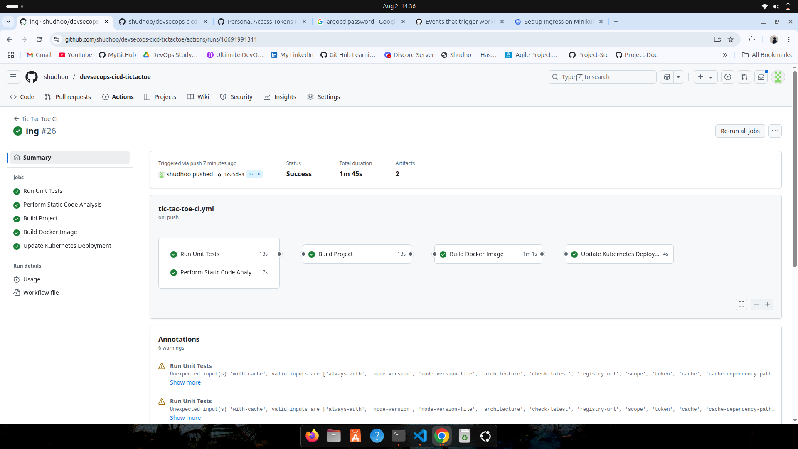
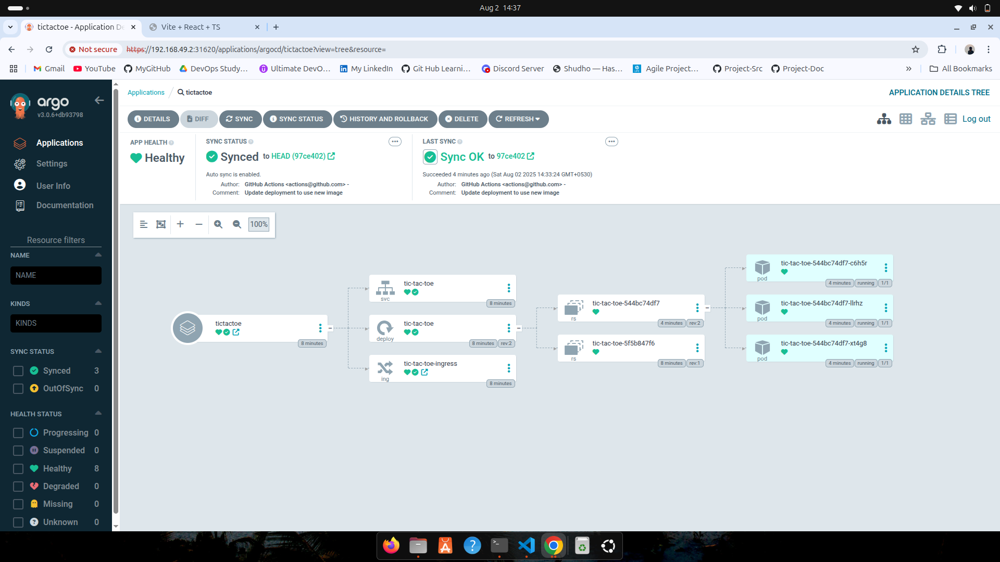
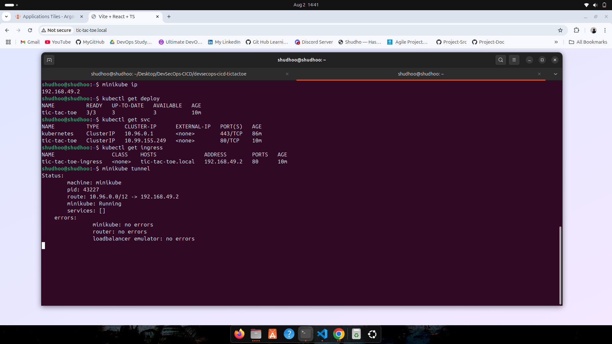
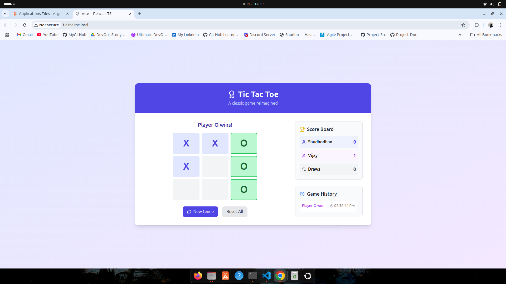

# Building a Complete DevSecOps Pipeline: From Code to Kubernetes with ArgoCD


In today's rapidly evolving software landscape, integrating security into every stage of the development lifecycle isn't just a best practice—it's essential. This blog post walks through building a comprehensive DevSecOps pipeline for a Tic-tac-Toe application using modern tools and practices.

## What is DevSecOps?

DevSecOps extends beyond simply building CI/CD pipelines with security measures. While it includes integrating static code analysis, OWASP security checks, and unit testing, true DevSecOps encompasses:

- Securing Terraform state files
- Using HashiCorp Vault for sensitive data management (API keys, tokens, passwords)
- Implementing Kubernetes encryption and secrets management
- Container security scanning and vulnerability assessment
- Infrastructure as Code (IaC) security

## Project Overview

This project demonstrates a complete DevSecOps implementation for a Node.js-based Tic-tac-Toe application, featuring:

- **Application**: React-based Tic-tac-Toe game
- **Infrastructure**: Minikube for local Kubernetes deployment
- **CI/CD**: GitHub Actions with integrated security scanning
- **Container Registry**: GitHub Container Registry (GHCR)
- **Deployment**: ArgoCD for GitOps-based continuous deployment
- **Development Environment**: Complete local development setup with Minikube

## Architecture and Tech Stack

### Core Technologies
- **Frontend**: React with TypeScript
- **Containerization**: Docker with multi-stage builds
- **Orchestration**: Kubernetes (Minikube for local development and deployment)
- **CI/CD**: GitHub Actions
- **GitOps**: ArgoCD
- **Security**: Trivy, ESLint, OWASP integration

## Implementation Deep Dive

### 1. Local Development Setup

Starting with local development is crucial for understanding application dependencies and environment variables. This approach helps DevOps engineers grasp the application architecture and requirements before building the pipeline.

**Key Benefits:**
- Understanding application flow and dependencies
- Identifying required environment variables
- Testing application functionality before containerization

### 2. Multi-Stage Dockerfile

Security and efficiency drove the decision to implement a multi-stage Docker build:

```dockerfile
# Stage 1: Build Stage
FROM node:20-alpine AS builder
COPY package.json ./
RUN npm install
COPY . .
RUN npm run build

# Stage 2: Production Stage  
FROM nginx:alpine
COPY --from=builder /app/dist /usr/share/nginx/html
EXPOSE 80
CMD ["nginx", "-g", "daemon off;"]
```

**Advantages:**
- Reduced image size
- Enhanced security (no build tools in production image)
- Improved deployment speed

### 3. GitHub Actions DevSecOps Pipeline

The pipeline implements a sequential job flow with integrated security checks:

#### Pipeline Jobs

**1. Unit Testing**
- Executes comprehensive test suites using Node.js 20
- Validates code functionality before proceeding

**2. Static Code Analysis (Linting)**
- Performs code quality checks using ESLint
- Generates detailed reports in JSON format
- Uploads artifacts for review

**3. Build Process**
- Compiles the project after successful tests and linting
- Creates build artifacts (dist folder)
- Prepares application for containerization

**4. Docker Image Build**
- Creates optimized Docker images using multi-stage builds
- Tags images with SHA-based versioning
- Pushes to GitHub Container Registry (GHCR)

**5. Security Scanning**
- **Trivy Vulnerability Scanning**: Scans Docker images for critical and high-severity vulnerabilities
- Prevents deployment of vulnerable images
- Generates security reports

**6. Kubernetes Manifest Updates**
- Automatically updates deployment files with new image tags
- Commits changes back to repository
- Triggers ArgoCD sync for deployment


*GitHub Actions workflow showing successful pipeline execution with all security checks*

### 4. Minikube Kubernetes Environment

This project uses Minikube to provide a complete local Kubernetes environment that closely mirrors production setups. Minikube offers several advantages for DevSecOps development:

**Benefits:**
- Full Kubernetes API compatibility
- Local testing of complete deployment pipeline
- Cost-effective development environment
- Easy integration with ArgoCD and other Kubernetes tools

### 5. GitOps with ArgoCD

ArgoCD serves as the continuous deployment controller, monitoring Git repositories for changes in Kubernetes manifests or Helm charts.

**Configuration:**
```bash
# Install ArgoCD on Minikube
kubectl create namespace argocd
kubectl apply -n argocd -f https://raw.githubusercontent.com/argoproj/argo-cd/stable/manifests/install.yaml
```

**Key Features:**
- 3-minute default sync interval
- Automated rollback capabilities
- Visual deployment tracking
- Multi-environment support


*ArgoCD dashboard showing healthy application deployment with sync status*

### 6. Minikube Development Environment

**Minikube Setup and Configuration:**
```bash
# Start Minikube with Docker driver
minikube start --driver=docker --cpus=2

# Enable Ingress addon for external access
minikube addons enable ingress

# Verify ingress controller is running
kubectl get pods -n ingress-nginx

# Create container registry secret
kubectl create secret docker-registry github-container-registry \
  --docker-server=ghcr.io \
  --docker-username=shudhoo \
  --docker-password=$GITHUB_TOKEN \
  --docker-email=shudhowani@gmail.com
```


*Terminal showing Minikube setup and Kubernetes resource verification*

**Local Access Configuration:**
```bash
# Get Minikube IP
minikube ip

# Add to /etc/hosts
echo "$(minikube ip) tic-tac-toe.local" >> /etc/hosts

# Start tunnel for local access
minikube tunnel
```


*Successfully deployed Tic-tac-Toe application running on local domain*

## Security Implementation

### Container Security
- **Base Image Selection**: Using Alpine Linux for minimal attack surface
- **Multi-stage Builds**: Eliminating build tools from production images
- **Vulnerability Scanning**: Trivy integration for continuous security assessment

### Secrets Management
- GitHub Secrets for sensitive data
- Kubernetes secrets for runtime configuration
- Container registry authentication

### Code Quality
- ESLint for static code analysis
- Automated security dependency scanning
- Pull request validation workflows

## Key Benefits Achieved

### 1. **Automated Security Integration**
Every code change undergoes comprehensive security scanning before deployment, ensuring vulnerabilities are caught early in the development cycle.

### 2. **GitOps Workflow**
ArgoCD provides declarative deployment management, ensuring infrastructure and application state consistency across environments.

### 3. **Scalable Architecture**
Kubernetes orchestration enables horizontal scaling and high availability, while Minikube provides a complete local development environment that mirrors production capabilities.

### 4. **Developer Experience**
Minikube setup allows developers to test the complete deployment pipeline locally, ensuring consistency between development and production environments.

### 5. **Compliance and Auditability**
All changes are tracked through Git, providing complete audit trails for security and compliance requirements.

## Best Practices Implemented

1. **Local-First Development**: Complete local Kubernetes environment with Minikube
2. **Immutable Deployments**: Container-based deployments with versioned artifacts
3. **Security-First Approach**: Integrated security scanning at every stage
4. **Monitoring and Observability**: ArgoCD provides deployment visibility
5. **Environment Consistency**: Minikube ensures development-production parity

## Challenges and Solutions

### Challenge 1: Container Registry Authentication
**Solution**: Implemented Kubernetes secrets for GHCR authentication, ensuring secure image pulls across environments.

### Challenge 2: Local Kubernetes Complexity
**Solution**: Minikube with ingress provides a production-like Kubernetes environment locally, enabling comprehensive testing of the complete deployment pipeline.

### Challenge 3: Security Integration
**Solution**: Multi-layered security approach with static analysis, vulnerability scanning, and secure base images.

## Future Enhancements

1. **Monitoring Stack**: Integration with Prometheus and Grafana
2. **Advanced Security**: Policy-as-Code with Open Policy Agent (OPA)
3. **Multi-Environment**: Staging and production environment automation
4. **Backup Strategy**: Automated backup and disaster recovery procedures

## Conclusion

This DevSecOps implementation demonstrates how modern tooling and practices can create a robust, secure, and scalable deployment pipeline. By integrating security at every stage—from code analysis to container scanning—we ensure that security isn't an afterthought but a fundamental part of the development process.

The combination of GitHub Actions for CI, ArgoCD for CD, and Kubernetes for orchestration creates a powerful platform that can scale with organizational needs while maintaining security and reliability standards.

The project showcases that DevSecOps isn't just about tools—it's about creating a culture and process that prioritizes security, automation, and continuous improvement throughout the software delivery lifecycle.

---

**Project Repository**: [DevSecOps Tic-tac-Toe Pipeline](https://github.com/shudhoo/devsecops-cicd-tictactoe)

**Technologies Used**: React, Node.js, Docker, Kubernetes, GitHub Actions, ArgoCD, Minikube, Trivy, ESLint
